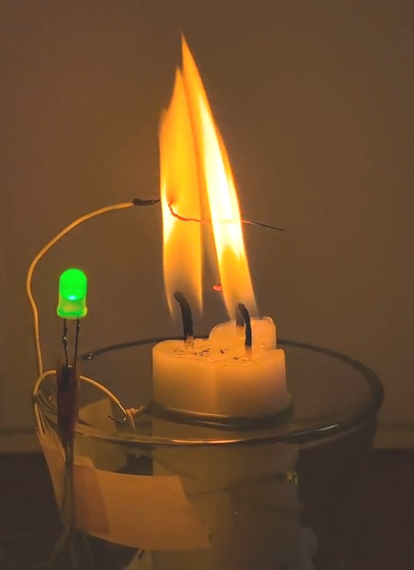
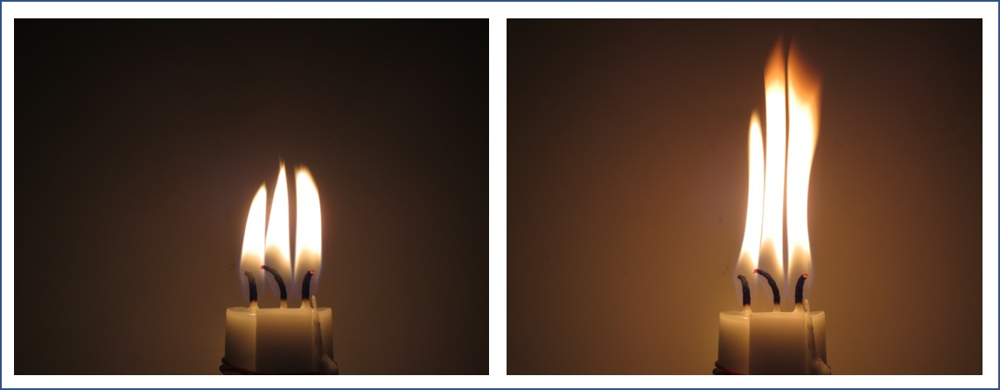
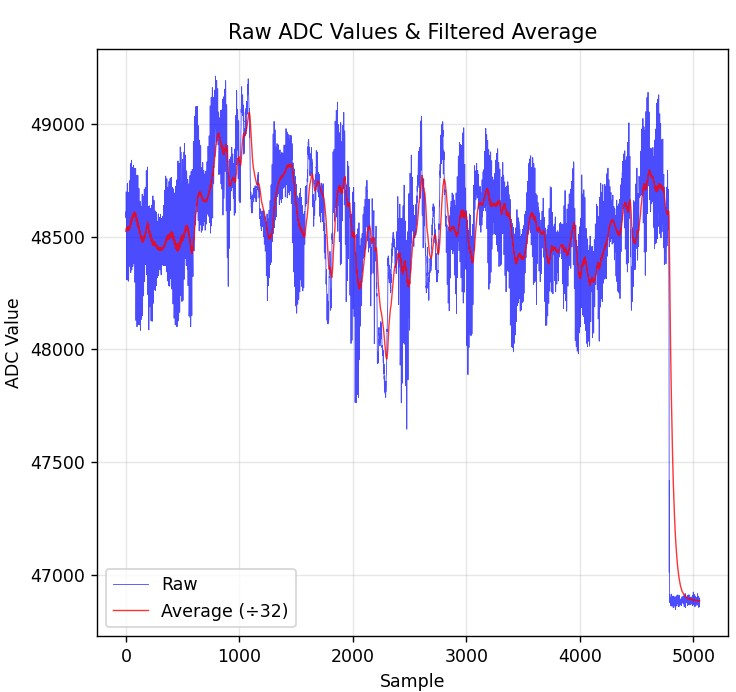
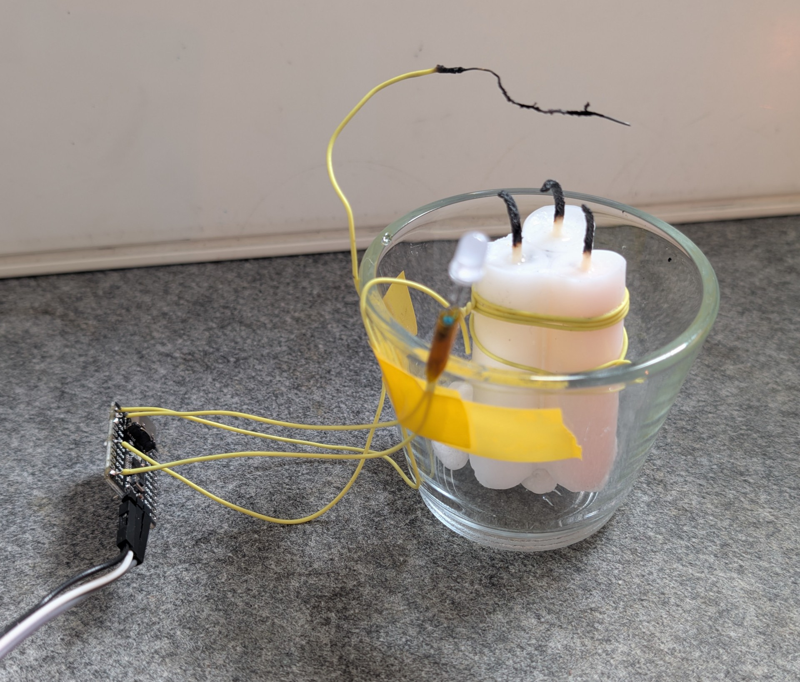
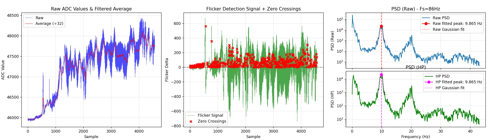
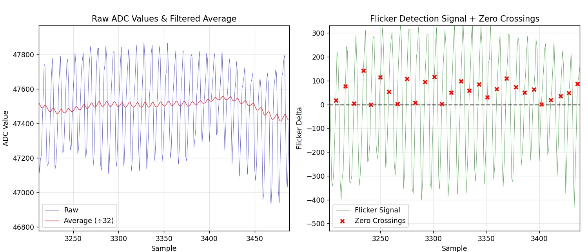

# Media Assets

All media assets used in the CandleSense project. 

## Images / GIF

| Preview | Filename | Description |
|---------|----------|-------------|
|  | `media/1Hz_clock.jpg` | 1 Hz reference clock capture. |
|  | `media/candleosc.jpg` | Candle flame oscillation sample. |
|  | `media/capsampling_long.jpg` | Long capture of capacitor sampling waveform. |
|  | `media/contraption.jpg` | Hardware measurement setup / rig. |
|  | `media/flameosc_small.gif` | Animated small flame oscillation. |
|  | `media/phototransistor.jpg` | Phototransistor sensor close-up. |
|  | `media/signal_chain.jpg` | Signal chain block diagram. |
|  | `media/signal_chain_detail.jpg` | Detailed signal chain view. |

## Video

`media/flameoscillator2_1080p.mp4`

HTML embed (may not render on all platforms):

<video src="./flameoscillator2_1080p.mp4" controls width="480"></video>

Direct download / open: [flameoscillator2_1080p.mp4](./flameoscillator2_1080p.mp4)

---
_Last updated: 2025-08-13_
